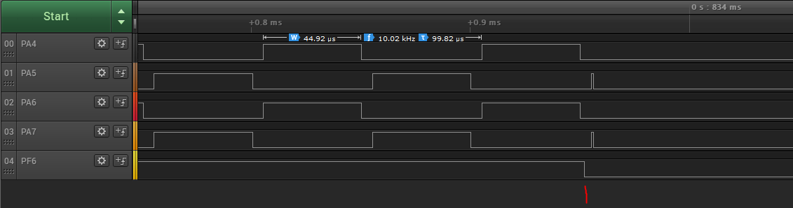
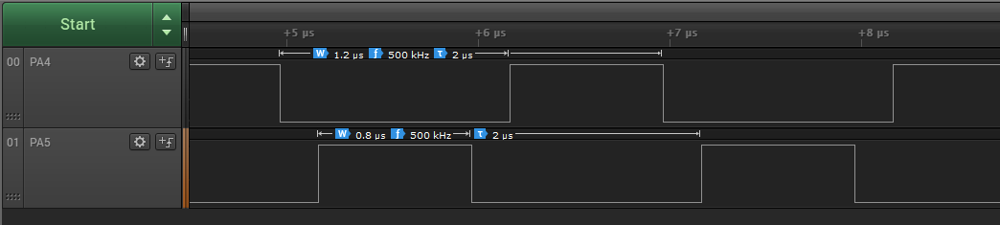

<!-- Please do not change this html logo with link -->

# Timer/Counter Type D (TCD) in Two Different Examples Using the AVR64DD32 Microcontroller Generated with MCC Melody

 The repository contains two MPLAB® X projects:
1.  [Controlling Synchronous Signals Using Input Events](#1-controlling-synchronous-signals-using-input-events) – This application shows how to configure the TCD to generate four signals, synchronized in pairs, and how to configure an input channel for fault detection.
2.  [Generating Complementary Driving Signals](#2-generating-complementary-driving-signals) – This program shows how to configure the TCD to generate two complementary signals.

## Related Documentation

More details and code examples on the AVR64DD32 can be found at the following links:

- [AVR64DD32 Product Page](https://www.microchip.com/wwwproducts/en/AVR64DD32)
- [AVR64DD32 Code Examples on GitHub](https://github.com/microchip-pic-avr-examples?q=AVR64DD32)
- [AVR64DD32 Project Examples in START](https://start.atmel.com/#examples/AVR64DD32CuriosityNano)

## Software Used

- [MPLAB® X IDE](http://www.microchip.com/mplab/mplab-x-ide) v6.00 or newer
- [MPLAB® XC8](http://www.microchip.com/mplab/compilers) v2.36 or newer
- [AVR-Dx Series Device Pack](https://packs.download.microchip.com/) v2.1.152 or newer
- [MPLAB® Code Configurator Melody](https://www.microchip.com/en-us/tools-resources/configure/mplab-code-configurator/melody) core 2.1.11 or newer

## Hardware Used

- The AVR64DD32 Curiosity Nano Development board is used as a test platform
   

## Operation

To program the Curiosity Nano board with this MPLAB® X project, follow the steps provided in the [How to Program the Curiosity Nano board](#how-to-program-curiosity-nano-board) chapter.  

## 1. Controlling Synchronous Signals Using Input Events

This application shows how to configure the TCD to generate four signals of 10 kHz frequency, synchronized in pairs with 5 us dead-times, and how to configure an input channel for fault detection. As long as the input channel value is low, the TCD stops the outputs. 
 **Note:** In this example, pressing the button on the board emulates the fault detection.

### 1.1 Setup

The following configurations must be made for this project:
- System clock is the default value of 4 MHz
- TCD
  - TCD0 clock source is High-Frequency Oscillator at 4 MHz with division factor 4
  - TCD0 is configured in Four Ramp mode, with channel C matching channel A and channel D matching channel B
  - Event A configured on the edge falling low with input filter enabled and set to fault, in Input mode: Wait
  - CMPASET and CMPBSET registers configured for 5 us dead-times
  - CMPACLR and CMPBCLR registers configured for 45 us duty cycles
  - The total period is 100 us: two dead-times and two duty cycles
  - All output channels (A, B, C, D) are enabled
 **Note:** The register that configures the output channels is under configuration change protection.

- EVSYS
  - PF6 configured as event generator on channel 4
  - TCD0INPUTA configured as event user on channel 4

| Pin               | Configuration      |
| :---------------: | :----------------: |
|         PA4 	    |   Digital output   |
|         PA5	      |   Digital output   |
|         PA6 	    |   Digital output   |
|         PA7	      |   Digital output   |
|         PF6 	    |   Digital input    |

### 1.2 Demo

The image below shows the four signals on pins PA4, PA5, PA6 and PA7. PA4 and PA6 are synchronized and PA5 and PA7 are complementary to those. At the red mark it is visible the fault condition detected and output signals being turned off.
  

### 1.3 Summary

This application shows how to configure the TCD to produce four signals of 10 kHz frequency with 5 us dead-time, synchronized in pairs, and an input channel for fault detection using the event system.  
[Back to top](#timercounter-type-d-tcd-in-two-different-examples-using-the-avr64dd32-microcontroller-generated-with-mcc-melody) 

## 2. Generating Complementary Driving Signals

This program shows how to configure the TCD to generate two non-overlapping, complementary signals with 500 kHz frequency and 200 ns dead-time.

### 2.1 Setup

The following configurations must be made for this project:

- System clock is configured at 20 MHz
- TCD
  - TCD clock source is High Frequency Oscillator at 20 MHz with division factor 1
  - The TCD is configured in Dual Slope mode with CMPBCLR programmed to generate a 2 us periodic signal, CMPASET and CMPBSET are configured to generate two complementary signals with a dead-time of 200ns
  - Channels A and B are enabled (the register that configures channels A and B is under configuration change protection)

| Pin               | Configuration      |
| :---------------: | :----------------: |
|         PA4 	    |   Digital output   |
|         PA5	      |   Digital output   |

### 2.2 Demo

The image below shows the complementary signals on the PA4 and PA5 pins. 
 

### 2.3 Summary

This program shows how to configure the TCD to generate two complementary signals with a configurable dead time.  
[Back to top](#timercounter-type-d-tcd-in-two-different-examples-using-the-avr64dd32-microcontroller-generated-with-mcc-melody) 

## How to Program Curiosity Nano board

This chapter shows how to use the MPLAB® X IDE to program an AVR® device with an Example_Project.X. This can be applied to any other projects.

- Connect the board to the PC

- Open the Example_Project.X project in MPLAB® X IDE

- Set the Example_Project.X project as main project

  - Right click the project in the **Projects** tab and click **Set as Main Project**
     

- Clean and build the Example_Project.X project

  - Right click the **Example_Project.X** project and select **Clean and Build**
     

- Select **AVRxxxxx Curiosity Nano** in the Connected Hardware Tool section of the project settings:

  - Right click the project and click **Properties**
  - Click the arrow under the Connected Hardware Tool
  - Select **AVRxxxxx Curiosity Nano** (click the **SN**), click **Apply** and then click **OK**:
     

- Program the project to the board
  - Right click the project and click **Make and Program Device**
     

 

- [Back to 1. Controlling Synchronous Signals Using Input Events](#1-controlling-synchronous-signals-using-input-events)
- [Back to 2. Generating Complementary Driving Signals](#2-generating-complementary-driving-signals)
- [Back to top](#timercounter-type-d-tcd-in-two-different-examples-using-the-avr64dd32-microcontroller-generated-with-mcc-melody)
